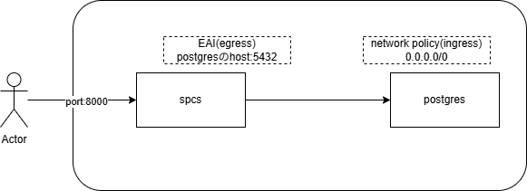

# snowflake_spcs_pg_sample

## ざっくり構成


## ざっくりながれ
1. 色々つくる(werehouse,compute pool,db,schema,role,image registry)
1. postgres用のnetwork policyつくる
1. postgresインスタンスをつくる
1. spcs用の外部アクセス統合(External Access Integretion)をつくる
1. spcsでサービスを作成

## snowflakeのcontainer registryにpush
SnowSQLを使って認証  
https://docs.snowflake.com/ja/user-guide/snowsql-install-config
```
snow spcs image-registry login --mfa-passcode otpのコードを入力
```
  
コンテナイメージをビルドしてpush
```
cd spcs

docker build --rm --platform linux/amd64 -t exture-practice.registry.snowflakecomputing.com/spcs_tutorial_db/data_schema/spcs_tutorial_repository/my_echo_service_image:latest .

docker push exture-practice.registry.snowflakecomputing.com/spcs_tutorial_db/data_schema/spcs_tutorial_repository/my_echo_service_image:latest


```

## serviceのendpointを取得してuiを確認
```
SHOW ENDPOINTS IN SERVICE echo_service;

# 上で取得したendpointの末尾に/uiを付けてアクセス
```